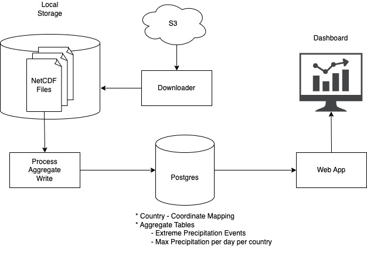
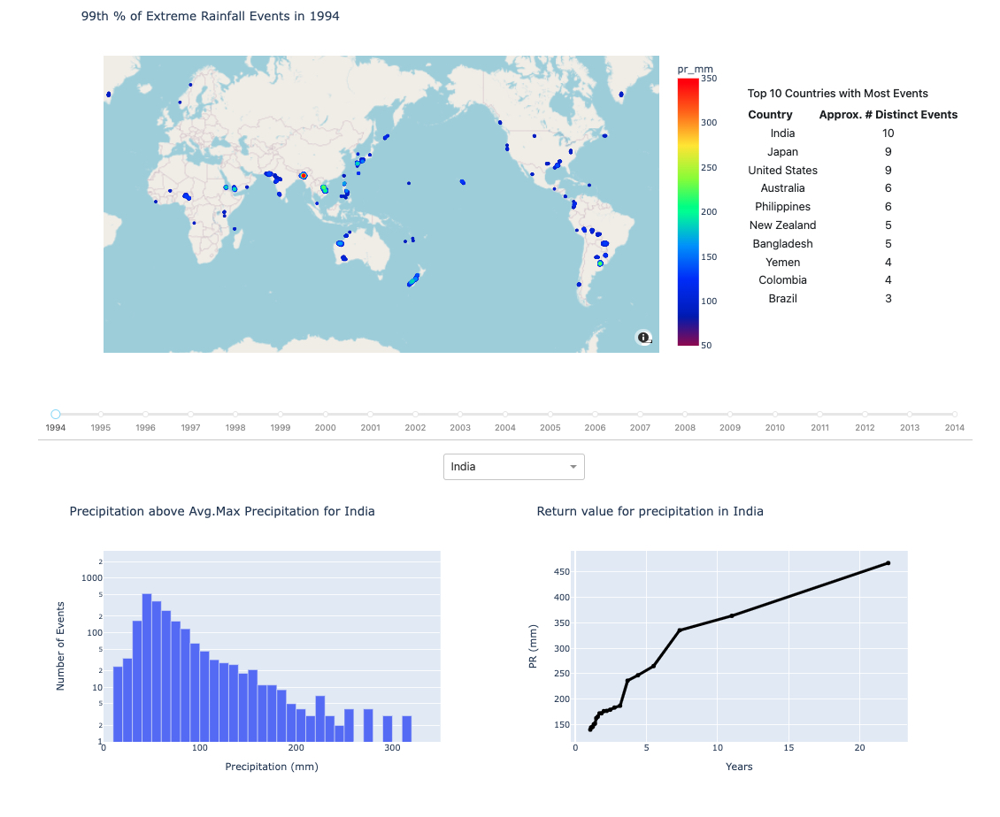

# Detecting Extreme Rainfall Events

This repository presents an application designed to visualize and analyze extreme rainfall events from 1994 to 2014.

## Data Source

The primary dataset utilized is from NASA’s Earth Exchange Global Daily Downscaled Projections (NEX-GDDP-CMIP6), offering daily climate data with a spatial resolution of approximately 1/4° (~25km). The data was retrieved from the following S3 bucket:

[NEX-GDDP-CMIP6 | Data Browse (amazonaws.com)](https://nex-gddp-cmip6.s3.us-west-2.amazonaws.com/index.html#NEX-GDDP-CMIP6/ACCESS-CM2/historical/r1i1p1f1/pr/)

## Main Goals

The application aims to:

1. Identify and visualize the extreme rainfall events at a grid level and highlight the most significant events globally, year by year.
2. Calculate and visualize the return period of rainfall events for each country.
3. Display the annual distribution of extreme rainfall events per country.
4. Report the countries experiencing the most extreme events annually.

## Setup

### Prerequisites

- Docker

### Installation and Running

Clone the repository and navigate to the project directory:

```bash
git clone https://github.com/SerhadS/precipitation_app.git extreme_rainfall
cd extreme_rainfall
```

Build and launch the application using Docker:

```bash
docker-compose up
```

This command sets up a PostgreSQL database, downloads the necessary data from the S3 bucket, processes the data for analysis, and starts the web app for visualization.

Access the dashboard via http://localhost:4255.

### Manual Setup

If you prefer to manually execute the files, follow these steps (tested on Python 3.11, compatibility with other versions is not guaranteed):

```bash
git clone https://github.com/SerhadS/precipitation_app.git extreme_rainfall
cd extreme_rainfall/src
# Create or switch to your desired Python environment
pip install -r requirements.txt
python write_data_to_db.py
python get_country_city_names.py
python get_daily_maximum.py
python visualization.py
```
## Repository Structure

```
- src/
  - mevpy/
  - get_country_city_names.py
  - get_daily_maximum.py
  - requirements.txt
  - visualization.py
  - write_data_to_db.py 
- data/
- Dockerfile
- docker-compose.yaml
```

## File Descriptions

- `write_data_to_db.py`: Processes files from S3, identifies extreme rainfall thresholds, and flags events above these thresholds.
- `get_country_city_names.py`: Maps grids to the nearest country and city.
- `get_daily_maximum.py`: Aggregates daily maximum rainfall data at the country level.
- `visualization.py`: Generates and serves the dashboard.
- `mevpy`: An external package.

## High-level Design



<br>


**Data Model**

The data model is given in ./data/DataModel.xlsx

## Dashboard Overview

The dashboard features:

- A world map displaying the 99th percentile of extreme rainfall events for a selected year.
- A table of countries with the most significant events for a selected year.
- A distribution chart of precipitation levels for events exceeding the grid threshold in a selected country and year.
- A return period plot for a selected country.



## Methodology

### Extreme rainfall thresholds

The logic for determination of thresholds for each grid was simple. It is basically the mean of maximum precipitation levels attained in years under investigation. These mean values for each grid are then used to identify extreme rainfall events. The only assumption made during the calculation of thresholds is ‘filtering out the precipitation levels lower than 1mm’ to avoid left-skewed distributions and noise build up. 

The method can be mathematically represented as follows:

$$
\text{Extreme\_Rainfall\_Threshold}_{i,j,k} = \text{mean}\left( \max_{\forall k} \left( \text{PR}[i][j][k] \right) \right)
$$

where (i,j) represents a (lat, lon) tuple and k represents the year. 


In the visualization (world-map), only the events that make up to 99th percentile (most extreme in a given year) are plotted to keep the dashboard clean and easily comprehensible.

<br>

### Return period calculation

For each day, the maximum precipitation within a country is identified and recorded for the period of the study (21 years). Therefore, it was possible to calculate the discrete return period of the events aggregated at the country level. Models can be fit to this data to mathematical modelling of these return periods. However, for this case study, the graphs are plotted using only the observed data.
